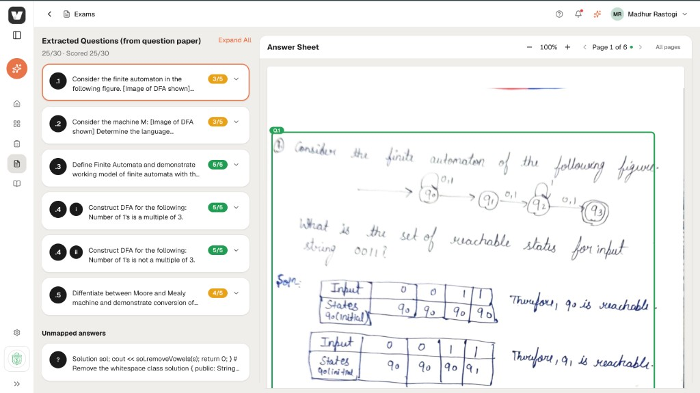
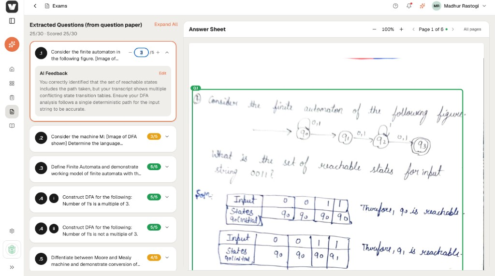
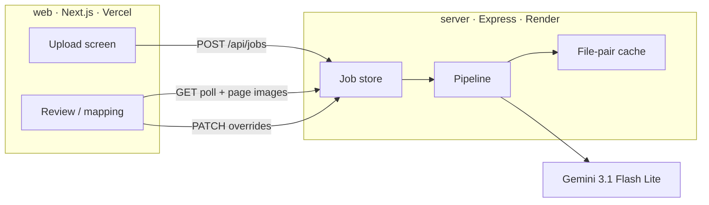

# VedaAI — Assessment Extraction & Answer Mapping

A teacher uploads a **question paper** and one **student answer sheet**. The app extracts every question, reads the handwriting, maps answers back to questions, and highlights the exact region on the sheet.

**Live demo:** [https://ai-tutor-rag.vercel.app/](https://ai-tutor-rag.vercel.app/)

[](https://ai-tutor-rag.vercel.app/)
[](https://nextjs.org/)
[](https://expressjs.com/)
[](https://ai.google.dev/)

<p align="center">
  
</p>

<p align="center"><em>Upload both files, then Start Mapping. The four coral badges around the illustration orbit the avatar (clock, chat, settings, cloud upload).</em></p>

<p align="center">
  
</p>

<p align="center"><em>Select a question on the left. The matching handwriting is boxed in green on the sheet, tagged Q.n.</em></p>

<p align="center">
  
</p>

<p align="center"><em>Human in the loop: the AI grade stays visible; the teacher can nudge the score and edit feedback without replacing the extraction.</em></p>

---

## Why this exists

Teachers spend a long time lining up printed questions with messy, out-of-order handwriting. This app is meant to answer three things quickly:

1. **Which question was answered**
2. **Where that answer sits on the sheet**
3. **Which questions were left blank**

AI grading is a **first pass**. The teacher remains in control: they can confirm the highlight, change a mark, and rewrite feedback.

---

## Features

- Drag-and-drop or click-to-upload for PDF or image files (question paper + one answer sheet)
- Async job pipeline (convert → extract questions → extract answers → map → grade)
- Sub-parts treated as separate questions (`11 (a)` and `11 (b)` are two rows)
- Original numbering preserved as printed
- Answers written out of order still map by label
- Unanswered questions flagged (score `0`, “Not answered.”)
- Unmapped handwriting in its own panel — never silently dropped
- Green bounding-box highlight on the sheet, with a `Qn` tag
- Multi-page answers stitched when a block continues onto the next page
- Per-question score, correct / partial / incorrect, and AI feedback
- **Teacher override** of score and feedback (human in the loop — additive, not a replacement for the AI pass)

---

## Why Gemini

The assignment allows any model with a free tier. Gemini is the extraction and grading engine because the job is **vision + structured JSON**, not retrieval.

| Need | Why Gemini fits |
| --- | --- |
| Printed papers **and** handwriting **and** diagrams | One multimodal model reads page images. No separate OCR pipeline. |
| Tight answer boxes for highlighting | The model returns `bbox` in a fixed 0–1000 space that the overlay can scale. |
| Stable pipeline stages | JSON-mode responses (`question[]`, `answer[]`, `grade[]`) parse into typed jobs. |
| Multi-page papers | Flash Lite is cheap enough to batch pages (questions and answers in groups of four). |
| Free-tier constraint | Google AI Studio keys work for a hiring demo without standing up GPU infra. |

Default model: **`gemini-3.1-flash-lite`** (`GEMINI_MODEL` to override). RPM 429s retry on the same model; daily quota is not retried — the job fails with a clear message.

This is **not** a RAG retriever. The repo name is historical. Each job looks at the uploaded pages only.

---

## Full workflow

```text
Teacher                  Next.js (Vercel)                 Express (Render)                 Gemini
   |                            |                                 |                          |
   |  1. Open /                 |                                 |                          |
   |  2. Drop both files        |                                 |                          |
   |  3. Start Mapping -------->|  POST /api/jobs                 |                          |
   |                            |  multipart: paper + sheet  ---->|  create job, return id   |
   |  4. /review/{jobId}        |                                 |                          |
   |     poll GET /api/jobs/:id |<--------------------------------|  queued                  |
   |                            |                                 |  rasterize PDFs → images |
   |                            |                                 |  extract questions ----->|  JSON questions
   |                            |                                 |  extract answers ------->|  label, transcript, bbox
   |                            |                                 |  map labels → questionId |  LLM only if needed
   |                            |                                 |  grade mapped pairs ---->|  score + feedback
   |  5. Mapping UI             |<--------------------------------|  status: done            |
   |     click question ------> |  page image + overlay           |                          |
   |     optional override ---> |  PATCH /grade-overrides         |  store on the job        |
```

### What each stage does

| Stage | What happens |
| --- | --- |
| **Upload** | Both files are required. **Start Mapping** enables only when both are present. |
| **Rasterize** | Each PDF page (or image) becomes a page image at a consistent size for vision. |
| **Question extraction** | Gemini reads the printed paper in page batches. Labelled sub-parts become separate entries. Shared stems fold into each sub-part so there is no empty “11” row. |
| **Answer extraction** | Gemini finds handwriting blocks: detected label, transcript, and a tight `bbox` in 0–1000 coordinates. Continuations across pages use `__continuation__`. |
| **Mapping** | Normalize labels (`Q11 (a)` / `11a` / `11-a` → same key). Exact match first. Fuzzy match is skipped for question-like keys so `12` never snaps to `11`. Remaining blocks go through one LLM pass; matches below confidence `0.5` stay **unmapped**. Continuations stitch onto the previous block. |
| **Grading** | Mapped pairs are scored (see below). Unanswered questions get `0`. Unmapped answers are not graded. If grading fails, mapping and highlights still show. |
| **Review** | Left: question cards + unmapped list. Right: answer sheet. Click a question to jump to that page and draw the highlight. The teacher may then override score or feedback. |

Jobs are stored **in memory** (about 1 hour, or until the API process restarts). Identical file pairs are cached by SHA-256 so a demo re-upload does not re-run Gemini. Teacher overrides live on that job; they are **not** written into the file-pair cache, so a fresh upload of the same PDFs still starts from the AI grade.

---

## How grading works

Grading is a suggestion the teacher can keep, tweak, or rewrite. It does not certify a mark scheme.

### Who gets a score

| Case | Score | Feedback |
| --- | --- | --- |
| Mapped answer | Gemini `score` / `maxScore` | 1–2 sentences on what the student wrote |
| No matching answer | `0` / inferred `maxScore` | “Not answered.” |
| Unmapped handwriting | Not graded | Shown under **Unmapped answers** |

Pills: **green** full marks, **amber** partial, **red** zero.

### How `maxScore` is decided

Printed papers rarely expose a machine-readable mark list. The app infers a ceiling from the question text, then lets Gemini propose one. The stored `maxScore` is the model’s value when it is a valid positive number; otherwise the heuristic is used.

```text
Question text
      │
      ▼
┌─────────────────────────────────────────────────────────┐
│  Heuristic (always computed; used as fallback)          │
│                                                         │
│  5  if the wording looks like a long / constructed      │
│     item: diagram, draw, explain, show that, calculate, │
│     hence, derive, compare, discuss, justify            │
│     — or the text is longer than ~180 characters        │
│                                                         │
│  2  if it looks like short recall:                      │
│     define, state, what is, name, list, give one        │
│     — or the text is shorter than ~80 characters        │
│                                                         │
│  3  everything else                                     │
└─────────────────────────────────────────────────────────┘
      │
      ▼
Gemini is asked to pick a reasonable maxScore from complexity
(short recall ~2, multi-part / diagram ~5) and a score ≤ that.
      │
      ▼
Use Gemini’s maxScore if it is a finite number > 0;
otherwise keep the heuristic.
```

Example from the screenshots: “Consider the finite automaton…” is a constructed item → ceiling **5**. A one-line “Define finite automata…” can land on **2**. Totals in the header are the sum of per-question scores over those ceilings (e.g. `25/30`).

The teacher cannot raise a mark above that question’s `maxScore`. Overrides are clamped to `0 … maxScore`.

### Human in the loop (override)

The AI pass always runs first. Override is an **add-on**: it does not skip extraction, mapping, or highlighting.

```text
AI grade + feedback
        │
        ▼
Teacher checks the green box on the sheet
        │
        ├── keep the AI mark
        │
        └── expand the card
              ├── click the score pill → type a value, or use + / −
              └── Edit on AI Feedback → rewrite the note → Done
                    │
                    ▼
              PATCH /api/jobs/:id/grade-overrides
              pill shows an “Edited” label
```

- Original Gemini grades stay on the job; the override map is separate.
- Score changes save immediately; feedback is debounced.
- Totals in the header recompute from the overridden scores.
- Same lifetime as the job (about an hour, or until the API restarts). Refresh keeps the edits. Re-uploading the same files does **not** restore teacher edits from cache.

---

## Architecture

The UI and the model work are split on purpose. Vercel serverless has a short timeout; a multi-page vision job does not.



| Unit | Role | Host |
| --- | --- | --- |
| `/web` | App Router UI only. Talks to the API over HTTP. | [Vercel](https://ai-tutor-rag.vercel.app/) |
| `/server` | Upload, rasterize, Gemini calls, mapping, grading, in-memory jobs. | Render (`https://ai-tutor-rag.onrender.com`) |

---

## Tech stack

| Layer | Choice |
| --- | --- |
| Frontend | Next.js 16 (App Router), React 19, TypeScript, Tailwind CSS v4 |
| Backend | Node.js, Express 5, TypeScript |
| AI | Google Gemini (`gemini-3.1-flash-lite` by default), JSON-mode vision |
| PDF / images | `pdf-to-img`, `pdf-lib`, `sharp` |
| Mapping helpers | `fastest-levenshtein` (limited fuzzy; never for question-like keys) |
| Local API | Docker Compose optional (`docker-compose.yml`) |

---

## Getting started

**Requirements:** Node.js 20+, a [Gemini API key](https://aistudio.google.com/apikey).

```bash
git clone https://github.com/Binary0011247/AI-Tutor-RAG.git
cd AI-Tutor-RAG
```

### 1. Server

```bash
cd server
cp .env.example .env
# set GEMINI_API_KEY and ALLOWED_ORIGIN=http://localhost:3000
npm install
npm run dev
```

API listens on `http://localhost:4000`. `GET /health` should return `{ "status": "ok" }`.

### 2. Web

```bash
cd web
echo 'NEXT_PUBLIC_API_BASE_URL=http://localhost:4000' > .env.local
npm install
npm run dev
```

Open [http://localhost:3000](http://localhost:3000).

### Environment

**`server/.env`**

```env
GEMINI_API_KEY=
GEMINI_MODEL=gemini-3.1-flash-lite
PORT=4000
ALLOWED_ORIGIN=http://localhost:3000
```

On Render, do **not** set `PORT` (the platform injects it). Set `ALLOWED_ORIGIN` to the Vercel origin.

**`web/.env.local`**

```env
NEXT_PUBLIC_API_BASE_URL=http://localhost:4000
```

On Vercel, set this to the public API origin, e.g. `https://ai-tutor-rag.onrender.com`.

---

## API

| Method | Path | Purpose |
| --- | --- | --- |
| `GET` | `/health` | Liveness. Used by Render and by the upload page to wake a cold instance. |
| `POST` | `/api/jobs` | Multipart `questionPaper` + `answerSheet` → `{ jobId }`. Rate limit: 10 / IP / minute. |
| `GET` | `/api/jobs/:id` | Job status, progress, warnings, result when `done`. |
| `GET` | `/api/jobs/:id/pages/questionPaper/:n` | Rasterized question-paper page. |
| `GET` | `/api/jobs/:id/pages/answerSheet/:n` | Rasterized answer-sheet page. |
| `PATCH` | `/api/jobs/:id/grade-overrides` | Teacher score / feedback override (job must be `done`). Does not mutate the original AI grade blob. |

Job status: `queued` → `converting` → `extracting_questions` → `extracting_answers` → `mapping` → `done` \| `error`.

---

## Project layout

```text
AI-Tutor-RAG/
├── web/                  Next.js UI
│   └── src/components/   Upload, extracting, mapping, highlight overlay
├── server/               Express API
│   └── src/
│       ├── routes/       jobs.ts
│       ├── services/     rasterize, extractQuestions, extractAnswers, mapAnswers, grade, gemini
│       └── store/        in-memory jobs, page images, result cache
└── docs/screenshots/
```

---

## Assumptions and limits

- One student, one answer sheet per job — no class roster or batch upload.
- No authentication and no database. Jobs expire with the in-memory TTL (~1 hour) or an API restart.
- **Max marks are inferred**, not read from a printed mark scheme. Treat grades as assistive.
- Mapping is probabilistic. Ambiguous labels stay in **Unmapped answers** rather than being forced onto a question.
- Poor scans, heavy overwriting, or unreadable handwriting reduce transcript and bbox quality.
- The Render free instance can cold-start. The upload page pings `/health` so the first job is less likely to hit a sleeping dyno; the first request after idle can still take a short wait.
- Gemini has daily quota. If the API returns a quota error, wait until reset (Pacific midnight) or use another key.
- Product chrome (Classroom, Library, Toolkit, notifications) is visual only.

---

## Design

UI follows the VedaAI hiring-assignment Figma (upload, extracting, mapping). Accent is coral (`#E8734A`); highlights on the sheet are green rounded outlines with a `Qn` tag. On the upload screen, the four coral badges (clock, chat, settings, cloud) **orbit** the teacher illustration; motion is disabled when the OS requests reduced motion.

---

